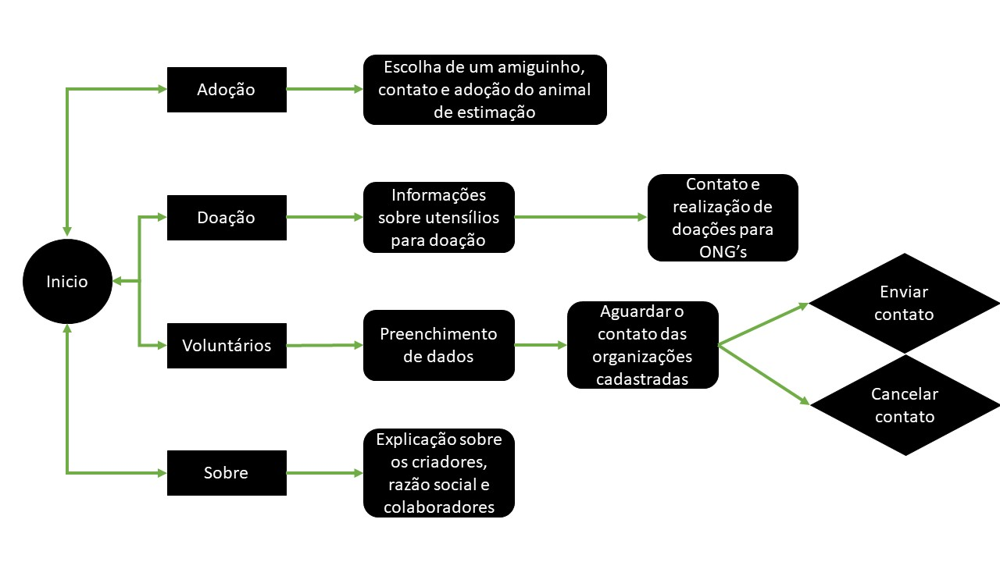
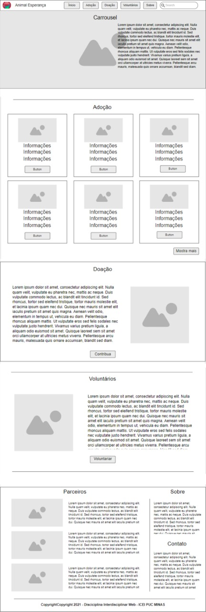
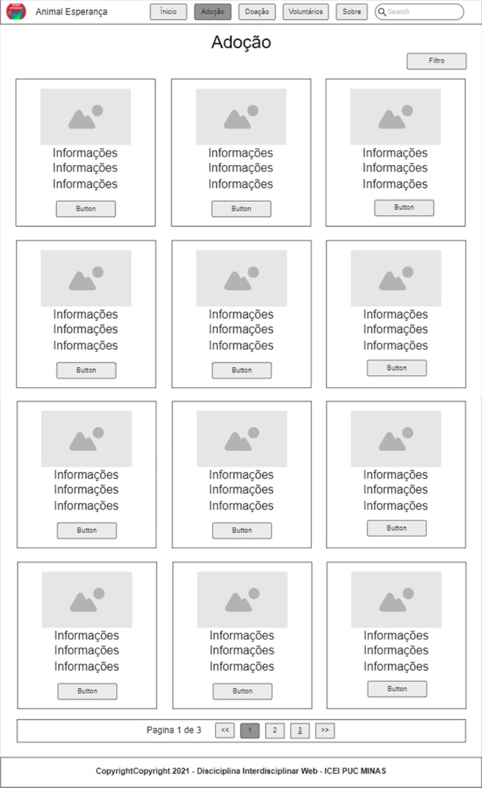
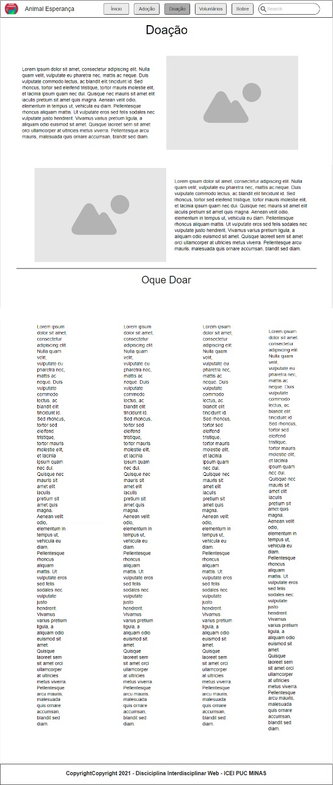
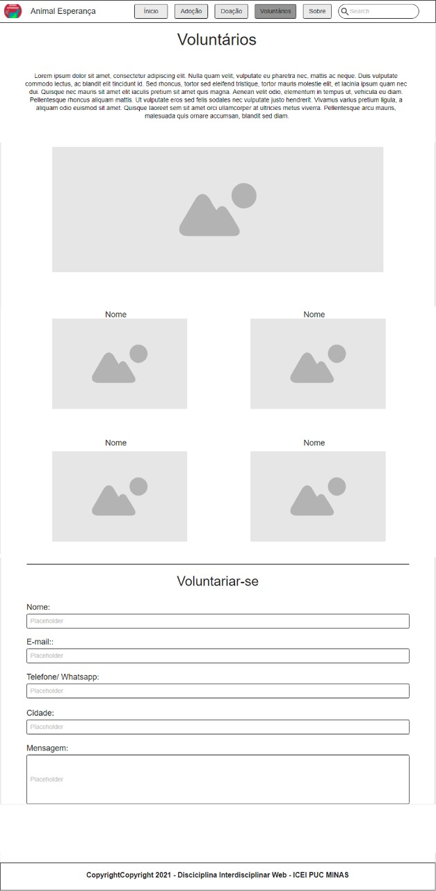
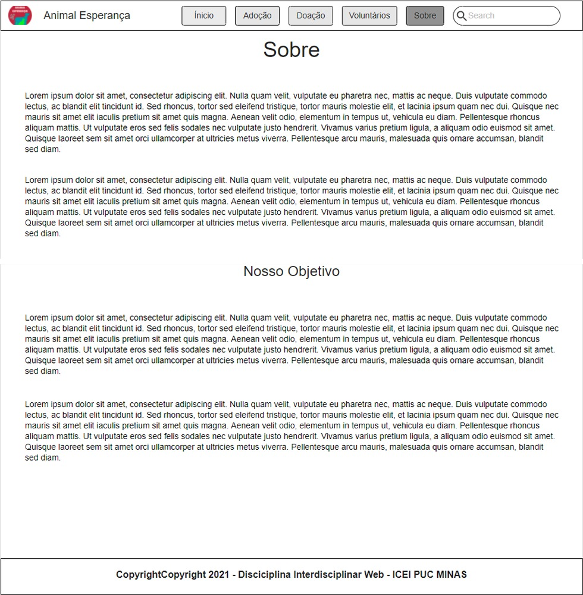

# Projeto de Interface

Pré-requisitos: <a href="2-Especificação do Projeto.md"> Documentação de Especificação</a>

Visão geral da interação do usuário pelas telas do sistema e protótipo interativo das telas com as funcionalidades que fazem parte do sistema (wireframes).

 Apresente as principais interfaces da plataforma. Discuta como ela foi elaborada de forma a atender os requisitos funcionais, não funcionais e histórias de usuário abordados nas <a href="2-Especificação do Projeto.md"> Documentação de Especificação</a>.

## User Flow

Adoção: O usuario deverá selecionar o animal desejado, e la estarão as informações de contato para o usuario realizar a adoção.

Doação: O usuario deverá escolher entre os itens necessarios nas organizações e realizar contato com a mesma para realizar a doação.

Voluntário: O usuario irá preencher com suas informações e esperar pelo contato de ONG's que iram precisar de ajuda.

Sobre: Página que conterá informações sobre o software, criadores, razão social e outras informações uteis.

## Wireframes

Página inicial aonde terá uma pequena quantidade do conteudo geral do software.

Página que hávera imagens dos animais e a realização do contato com as organizações para realização da adoção.

Página aonde terá os itens que podem ser doados e a forma para contato com as organizações cadastradas.

Página aonde conterá imagens de voluntários e também o meio de se voluntariar.

Página que contemplara explicação sobre o objetivo e outros fins sobre o software.

