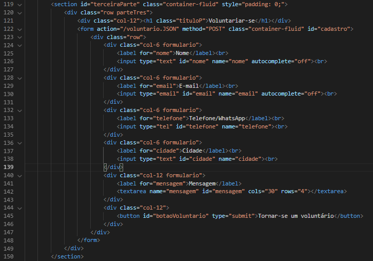

# Programação de Funcionalidades

Código HTML aonde contem a entrada de dados do usuário, nessa seção o usuário irá informar seus dados de contato e enviar uma mensagem e irá aguardar o retorno de alguma organização que precise de ajuda.

        
        
        
        
Código Java Script aonde será armazenado as informações passadas pelo usuário, contendo validação dos campos preenchidos, se houver algum campo não preenchido aparecera um alerta para o usuário informando que o determinado campo não foi preenchido.        
        
onload = () => {

    var salvar = []

    cadastro.onsubmit = (evento) => {
        if (nome.value ==0){
            alert('O campo nome esta sem preencher')
            evento.preventDefault();
        }
        else if (email.value ==0){
            alert('O campo email esta sem preencher')
            evento.preventDefault();
        }
        else if (cidade.value ==0){
            alert('O campo cidade sem esta preencher')
            evento.preventDefault();
        }
        else if (telefone.value ==0){
            alert('O campo telefone sem esta preencher')
            evento.preventDefault();
        }
        else{
            let voluntarios = { nome: nome.value, email: email.value, telefone: telefone.value, mensagem: mensagem.value, cidade: cidade.value };
            salvar.push(voluntarios)
            localStorage.setItem('voluntarios', JSON.stringify(salvar));
            evento.preventDefault();
            nome.value = "";
            email.value = "";
            telefone.value = "";
            mensagem.value = "";
            cidade.value = "";
            alert('Cadastro Realizado!')
            console.log(voluntarios)
        }
    }
}

> **Links Úteis**:
>
> - [Trabalhando com HTML5 Local Storage e JSON](https://www.devmedia.com.br/trabalhando-com-html5-local-storage-e-json/29045)
> - [JSON Tutorial](https://www.w3resource.com/JSON)
> - [JSON Data Set Sample](https://opensource.adobe.com/Spry/samples/data_region/JSONDataSetSample.html)
> - [JSON - Introduction (W3Schools)](https://www.w3schools.com/js/js_json_intro.asp)
> - [JSON Tutorial (TutorialsPoint)](https://www.tutorialspoint.com/json/index.htm)
